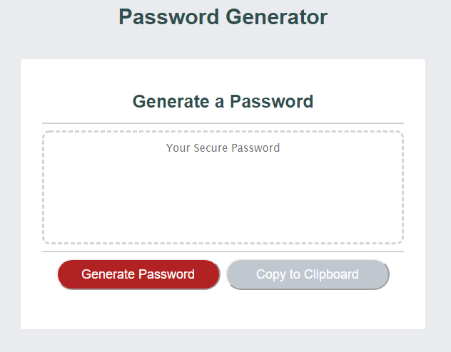
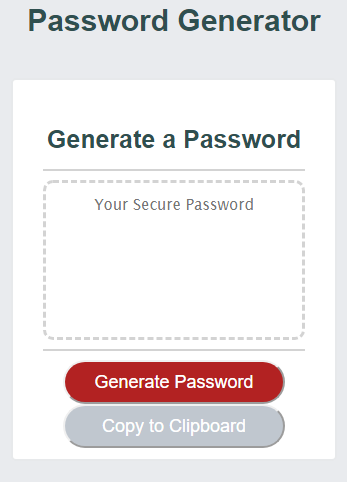

# Password Generator

https://khny258.github.io/Password-Generator/

<strong>Desktop</strong>
 

<strong>Mobile</strong>
 

Requirements for the Password Generator:

1) The new password that is generated has to be secure. 

2) After going through a series of prompts for: 
- length of at least 8 characters no more than 128 characters 
- lowercase 
- uppercase
- numeric
- and/or special characters

3) The input should be validated and at least one character type should be selected.

4) When all the prompts are answered, the password is generated to match the selected criteria.

5) You can click "Copy to Clipboard" on the right. 
